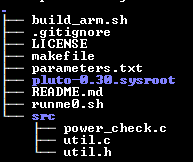
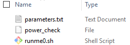

# CN0534 Production Script
This is version 1 of the CN0534 production test which uses Pluto as the test platform.

The main script is based on the `power_check.c` script found on the [plutosdr_scripts repository](https://github.com/analogdevicesinc/plutosdr_scripts) with modifications to accommodate features to test of CN0534.

Running first the build script is necessary. Prior to running, set the build environment first in the `./build_arm.sh`, change the CC_DIR to the path of the bin folder of the compiler.

For Linux, with the cross compiler set on the host pc and linked with the sysroot used by the pluto, run `./build_arm.sh`. The sysroot used should match to the firmware of pluto. As of this writing, pluto firmware v0.30 is used. The sysroot folder should be in the same directory as the `./build_arm.sh`. Also, [updating Pluto to AD9364 frequency range](https://wiki.analog.com/university/tools/pluto/users/customizing#updating_to_the_ad9364) is necessary to accommodate CN0534 frequency range.

With this build, the binary file can now be stored in a flash drive together with the `runme0.sh` and `parameters.txt`. And upon pluto power up, the binary test file automatically starts and the test is now running.

What this script will do:
1.  Get test parameters from parameters.txt.
2.	Run test in every test line.
3.	Frequency and scale is set on Pluto and the received signal is measured.
4.	The test checks for frequency tolerance, sfdr, RSSI and peak power.
5.  CN0534 DS2 (red LED) should turn on once during the test. 
6.	After execution of the test, LED1 will be Solid ON if the EVAL CN0534-EBZ passes the necessary tests. .
7.	If an error happens, or invalid measurements persist 3 retries, LED1 will be turned OFF if the EVAL-CN0534-EBZ fails the tests
