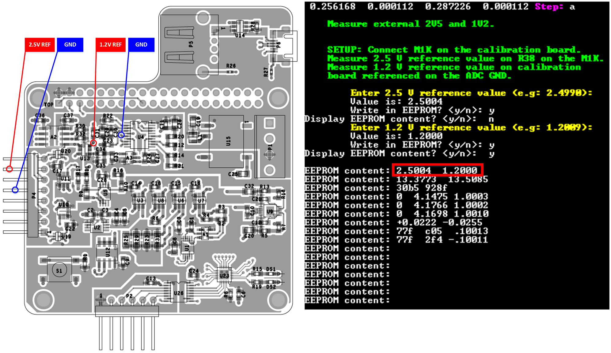
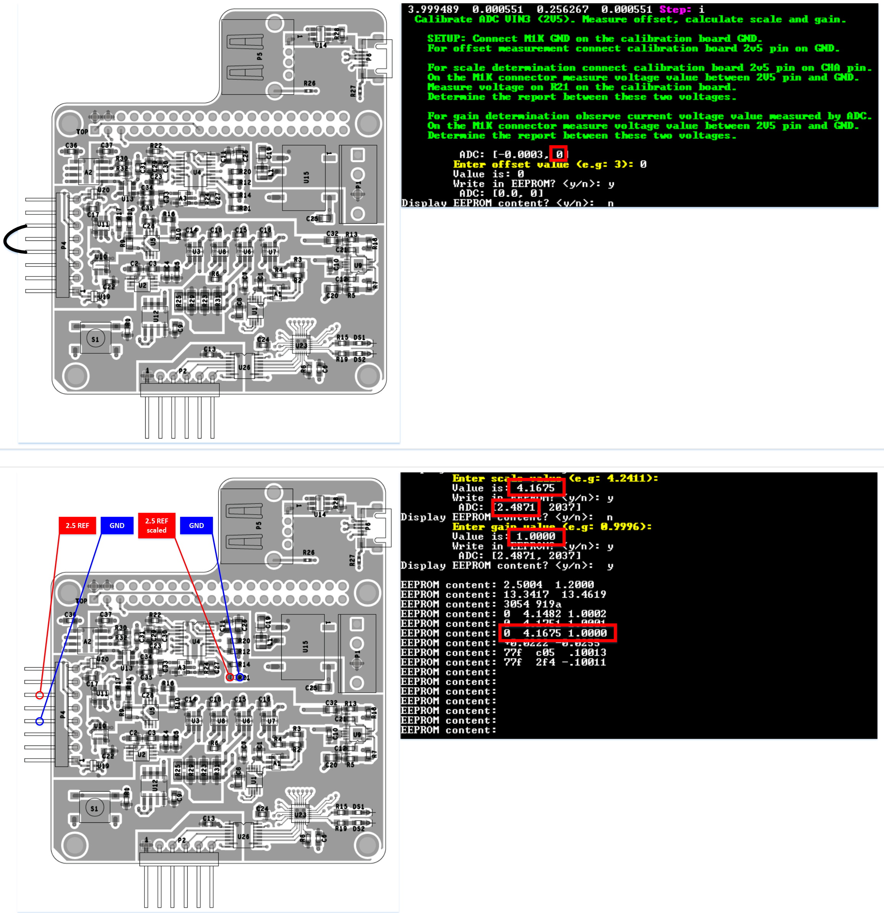

# ADALM 1000 production flashing + testing

This set of scripts handles the factory flashing + testing for the ADALM-1000 board.

**Hardware requirements:**

-   [Raspberry Pi](https://www.raspberrypi.org/)
-   [Adafruit PiTFT 2.2" HAT Mini Kit - 320x240 2.2" TFT - No Touch](https://www.adafruit.com/product/2315)

**Software requirements:**

-   [Linux Raspbian Stretch or later](https://www.raspberrypi.org/downloads/raspbian/)

# How to setup (software)

On a Raspbian Stretch image:

-   download this repo
-   cd to it
-   run `./setup_env.sh`
-   reboot
-   done

All that's needed for factory flashing & testing should be ready & running.

# The main scripts (described)

There are 2 main scripts to consider. One is `setup_env.sh` that was described earlier, and the `adalm_1000_factory.sh` script. The rest are hooked into these 2 scripts, but this section will describe what they do & how.

## setup_env.sh

Sets up the initial environment. It should not be run as `root` because that will just enforce too many `root` permissions and that's not needed.

It does require `sudo` access and the script will ask for it once.

The steps it does:

-   checks if the current user is root/sudo ; exits with a message if it is
-   adds the current user to the `/etc/sudoers` file with the `NOPASSWD:` argument (so that the sudo passwd is not asked for later)
-   sets up USB automount ; for the RPi + PiTFT, the script will run in `bash` without any X enviroment ; so, the desktop services that do the automount are no longer available in this environment, meaning that this needs to be setup explicitly
-   it will empty-out the Wi-Fi & SSH scripts in `/etc/profile.d` ; this is a bit hacky, but it's the easiest way to get rid of some scripts on `bash` console logon ; those services (for which the scripts complain) are not needed, so we don't want to print anything for them
-   install `apt` pre-requisites for build
-   enable I2C & SSH via `raspi-config`
-   download & build the latest release of [libsmu](https://github.com/analogdevicesinc/libsmu/releases)
-   add an entry in `.bashrc` to start the `adalm_1000_factory.sh` script when bash starts ; this also checks if the env is a SSH session and it won't start the script in that situation
-   download & run the Adafruit script for setting up the PiTFT screen ; this step is a automated, so the script version that is run is locked to a specific version/git-hash
-   call the `update_m1k_release.sh` which will download the latest M1k firmware from <https://github.com/analogdevicesinc/m1k-fw/releases> and put it into `release/m1k`

## adalm_1000_factory.sh

Is the main loop that orchestrates all things.

When called, it will:

-   check the shell context
-   it the `tty` parameter is passed and it's an SSH context, it will error out
-   set/load all needed env vars (PATH, LD_LIBRARY_PATH, PYTHON, etc)
-   start in background the following scripts: `call_home`, `autosave_logs.sh` & `autoupload_logs.sh`
-   if no FW files are present, it will display a message on the shell and loop until they are present
-   call each `main_*.py` scripts in this order:
-   main_measure_voltage.py - this also waits for a button to be pressed to continue, once pressed, the procedure will start
-   main_source_voltage.py
-   main_measure_current.py
-   main_source_current.py
-   main_check_performances.py
-   if any of the above scripts throws an exception or a non-zero code, it will display `FAIL` (red) on the screen
-   otherwise it will display `PASS` (green) on the screen
-   logging will be stored and re-directed from stdout/stderr to the `log` directory

## General information about logging (logic part of adalm_1000_factory.sh)

All log files are stored in the `log` sub-directory which gets generated.

This logic is in the `adalm_1000_factory.sh` script.

The following log files:

-   `temp.log` - is a temporary log file, where the current console output is stored, until the device serial number is available, after a procedure finishes (pass or fail) this gets moved to a `log/<serial_number>/execlog.txt` file. If it's present on boot, it gets appended to `_errorslog.txt`
-   `_errors.txt` - these are errors that can't be assigned to any device, because there is no S/N when things get added here
-   `_stats.log` - contains 2 variables `PASSED_CNT` & `FAILED_CNT` ; the total number of passed / failed flashing procedures for this test-jig
-   `_results.log` - if there is a S/N for a device, this is a central place where each S/N is stored with `PASSED/FAILED - <S/N> - $(date)`
-   `log/<serial_number>/` - each device has it's own folder with the S/N ; in there are 3 log files:
-   `log.txt` - stored from the Python scripts
-   `calib.txt` - calibration file for this device
-   `execlog.txt` - raw output log ; the same info that is displayed on the screen

## Getting the logs (autosave_logs.sh & autoupload_logs.sh)

These logs can be accessed by 2 methods:

-   plug in USB stick with a `autosave_logs` folder ; the `autosave_logs.sh` script will save all logs in that folder in `tar.gz` format ; if the USB stick is present, a new file will be written each minute ; only the last 5 archives will be kept
-   the test-jig will continuously try to upload the `logs` directory (archived in `tar.gz` format) each 5 minutes ; this is done via the `autoupload_logs.sh` script; logs will be stored on the `testjig.hopto.org` machine in the `~/jiglogs` folder

## Remote access/connection to the jig (call_home script)

The `adalm_1000_factory.sh` will call the `call_home` script (which will run in background). This will try to open a SSH reverse tunnel to `testjig.hopto.org` on port `2222`.

Initially the reverse SSH port was `2000` and needed to be manually updated per-jig, however this is not feasible as the number of jigs grows. And it was also found that if a connection drops, it still shows up on the `testjig.hopto.org` machine.

So, now, the jig attempts to connect on `2000` and if unsuccesful, increments the port number until `3000` (when it rolls back to 2000). This is not great, because we won't be able to identify jigs without connecting to them, but it's a bit better than manually configuring each port. This procedure may be improved later.

On the `testjig.hopto.org` machine, running `netstat -pant | grep LISTEN` will show up a listening port `2000-2999`.

The user may connect back via (for example for port 2002):

    ssh -o StrictHostKeyChecking=no pi@localhost -p 2002

If that doesn't work, the user may be `jig` or `jig6` and that may be an M2k test jig.

Once connected, you can access the screen via:

    sudo screen -x

The `adalm_1000_factory.sh` script is wrapped with a `screen` command to be able to see what's going on.

## Demo

# Calibration board configuration

Before to calibrate the M1K board, the calibration board needs to be configurated.
For this operation we need:

**Hardware requirements:**

-   M1K board
-   Digital multimeter
-   DC power supply
-   Alligator Clip to 4mm Banana Plug Cable
-   A short wire with female terminals

**Software requirements:**

-   `configure_calibration_board.sh`.

To start this process do the following steps:

-   connect an M1K board on the jig via USB.
-   run `sudo screen -x` and press `CTRL + C` to stop the `adalm_1000_factory.sh` script.
-   change directory (i.e.: `cd Desktop//m1k-production-test-master/`) to `configure_calibration_board.sh` script location.
-   run `sudo chmod +x config_calibration_board.sh` to make the script executable if is not already.
-   run `sudo ./config_calibration_board.sh`.

If everything works fine a menu should appear like in the bellow picture.

Type a letter followed by the ENTER key to select the desire configuration step.

The configuration can be made in the following order:

## 1. Measure external voltage references

This step require to measure with a digital multimeter the 1.2 V and 2.5 V references between indicated points and then to enter the measured values in the application to be write in the EEPROM.

## 2. ADC calibration for M1K 5.0 V reference measurement

This step require to determine the offset, scale and gain for the ADC input used to measure the M1K 5 V reference.
To determine the offset is necessary to short the 5 V pin to ground, read the offset value and enter that in the application to be write in the EEPROM.
To determine the scale is necessary to connect the M1K board on the calibration board and then to measure with a digital multimeter the 5.0 V reference voltage and the scaled voltage on the indicated points. After that calculate the report between these two measurements and enter the resulted value in the application to be write in the EEPROM.
To determine the gain, read the converted ADC measurement and calculate the report between ADC and digital multimeter measurements and enter the resulted value in the application to be write in the EEPROM.

## 3. ADC offset calibration for M1K voltage channel measurement

This step require to determine the offset for the ADC input used to measure the M1K sourced voltage.
To determine the offset is necessary to short the M1K channel A pin to ground, read the offset value and enter that in the application to be write in the EEPROM.

## 4. ADC scale and gain calibration for M1K voltage channel measurement

This step require to determine the scale and gain for the ADC input used to measure the M1K sourced voltage.
To determine the scale is necessary to connect the M1K board on the calibration board and then to measure with a digital multimeter the sourced voltage and the scaled voltage on the indicated points. After that calculate the report between these two measurements and enter the resulted value in the application to be write in the EEPROM.
To determine the gain, read the converted ADC measurement and calculate the report between ADC and digital multimeter measurements and enter the resulted value in the application to be write in the EEPROM.

## 5. ADC calibration for M1K 2.5 V reference measurement

This step require to determine the offset, scale and gain for the ADC input used to measure the M1K 2.5 V reference.
To determine the offset is necessary to short the 2.5 V pin to ground, read the offset value and enter that in the application to be write in the EEPROM.
To determine the scale is necessary to connect the M1K board on the calibration board and then to measure with a digital multimeter the 2.5 V reference voltage and the scaled voltage on the indicated points. After that calculate the report between these two measurements and enter the resulted value in the application to be write in the EEPROM.
To determine the gain, read the converted ADC measurement and calculate the report between ADC and digital multimeter measurements and enter the resulted value in the application to be writed in the EEPROM.

## 6. ADC offset calibration for positive current measurement

This step require to determine the offset for the ADC input used to measure the M1K sourced current.
To determine the offset is necessary to disconnect the M1K from the calibration board, read the offset value and enter that in the application to be write in the EEPROM.

## 7. ADC offset calibration for negative current measurement

This step require to determine the offset for the ADC input used to measure the M1K sourced current.
To determine the offset is necessary to disconnect the M1K from the calibration board, read the offset value and enter that in the application to be write in the EEPROM.

## 8. ADC gain calibration for positive current measurement

This step require to determine the gain for the ADC input used to measure the M1K sourced current.
To determine the gain source a voltage with a digital power supply and measure the resulted current with a digital multimeter. Read the hexadecimal ADC code and the digital multimeter measurement and enter the resulted values in the application to be write in the EEPROM.

## 9. ADC gain calibration for negative current measurement

This step require to determine the gain for the ADC input used to measure the M1K sourced current.
To determine the gain source a voltage with a digital power supply and measure the resulted current with a digital multimeter. Read the hexadecimal ADC code and the digital multimeter measurement and enter the resulted values in the application to be write in the EEPROM.

## 10. Calculate resistance for a positive current measurement

This step require to already have the external ADC calibrated and to have an M1K board up and running plugged in the calibration board. We need this to measure the M1K 2.5 V reference, the sourced voltage by the M1K and also the resulted current.
If ADC measurements are correct, then we only need to enter the resulted value in the application to be write in the EEPROM.

## 11. Calculate resistance for a negative current measurement

This step require to already have the external ADC calibrated and to have an M1K board up and running plugged in the calibration board. We need this to measure the M1K 2.5 V reference, the sourced voltage by the M1K and also the resulted current.
If ADC measurements are correct, then is only necessary to enter the resulted value in the application to be write in the EEPROM.

## 12. Voltage drop compensation for positive current measurement

This step require to determine the voltage drop over the channel selection switches to calculate more accurate the resulted positive current.
To determine the voltage drop measure with a digital multimeter the voltage on the indicated points.
After that enter the resulted value in the application to be write in the EEPROM.

## 13. Voltage drop compensation for negative current measurement

This step require to determine the voltage drop over the channel selection switches to calculate more accurate the resulted negative current.
To determine the voltage drop measure with a digital multimeter the voltage on the indicated points.
After that enter the resulted value in the application to be write in the EEPROM.

## 14. Set DAC code for 1.25 V

This step require to measure with a digital multimeter the voltage generated by the external DAC. To change the voltage enter the hexadecimal code in the application to be write in the EEPROM and to set the DAC to generate a new voltage value. If the M1K board is calibrated, the voltage can be verified directly.

## 15. Set DAC code for 3.75 V

This step require to measure with a digital multimeter the voltage generated by the external DAC. To change the voltage enter the hexadecimal code in the application to be write in the EEPROM and to set the DAC to generate a new voltage value. If the M1K board is calibrated, the voltage can be verified directly.

# ADALM1000 Customer Evaluation Board Test Procedure

## Overview

The production testing is automated with the only manual step being the cable connections to jig.
Required hardware

-   M1k test jig

### Required setup for production test

-   Plug the shorter micro USB cable from any Raspberry Pi USB connector to the micro USB connector on the Raspberry Pi shield.
-   Plug the longer micro USB cable on the Raspberry Pi shield.
-   Plug in the Raspberry Pi power supply.
-   After about couple seconds the following message will be printed on the screen “Press button #17 to start.”
-   At this point the test jig is ready.

### Test process

1.  Plug in the micro USB on the PCB board.
2.  Plug the 6 pin cable on the PCB board. Be careful at pin 1 indicator. It should be on the same side like on the test jig.
3.  Press the #17 button. The progress will be printed on the screen. The test should not take more than one minute.

4.  If at the end of the test PASS is written on the screen the board passed the test.

5.  If at any point during the test FAIL is written on the screen the board FAILED. Please remove the board from the test jig and test it again.

If the board fails a third time it can be considered broken. Please write the error message on the board and remove it from the production line
